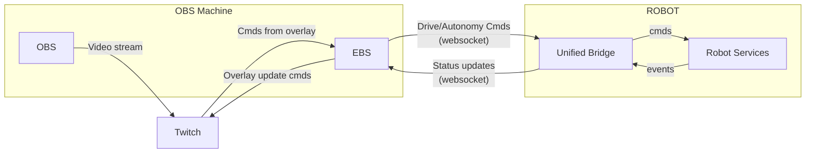

# EarthSense Overlay

Twitch integrations for dispatching an EarthSense robot (TerraSentia Plus / TSP)
on preset routes, from a viewer overlay.



`ebs/`'s video feed goes to Twitch separately via OBS, running on the same
machine as `ebs/` (the "OBS Machine"). The robot is not on the internet — it
hosts its own wifi network, and the OBS Machine joins that wifi (in addition
to being wired to ethernet) to reach it.

## Layout

- `overlay/` — Twitch Video Overlay Extension frontend. See
  [Packaging the extension](#packaging-the-extension) to build the upload zip.
- `ebs/` — Extension Backend Service, bridges the Twitch Extension with the
  robot's Unified Bridge over a websocket. **WIP** (see `ebs/README.md`).

The chat bot that used to live in `bot/` has been removed — all dispatch now
goes through the overlay.

## Packaging the extension

Twitch's Developer Console (Extensions → Asset Hosting) needs a zip of
`overlay/`'s files, without a wrapping folder, and without the local dev/test
harness. The build also bakes the HTTPS URL where `ebs/` is reachable into
`js/ebs-config.js` (Twitch's extension CSP forbids setting it inline), so you
must pass that URL:

```bash
EBS_BASE_URL=https://your-ebs-url ./overlay/package.sh
# or: ./overlay/package.sh --ebs-url https://your-ebs-url
```

This writes `dist/extension.zip` (gitignored). Options: `--out <path>` for a
different output location. The URL must be `https://` (Twitch blocks
mixed content) and the script refuses to build a zip that still contains the
placeholder URL. That same host must also be added to the Twitch console's
**Capabilities → Allowlist for URL Fetching Domains**.

## Status

**Still Testing**

- The Unified Bridge (robot side) is being built separately. `ebs/`'s
  websocket client for it (`ebs/app/bridge_client.py`) is a stub: the wire
  protocol, command vocabulary, and connection direction are all
  placeholders until that lands — see the comments at the top of that file.
- `ebs/app/routes_config.py` routes use placeholder commands, pending the
  above.
- `ebs/`'s current deployment is a local dev server behind a Cloudflare quick
  tunnel
  - The extension's "Allowlist for URL Fetching Domains" (Developer Console →
  Capabilities) must match whatever's actually set as `EBS_BASE_URL`
- `EBS_DEV_MODE` must be `false` (with a real `TWITCH_EXTENSION_SECRET`)

See `ebs/README.md` for the rest.
